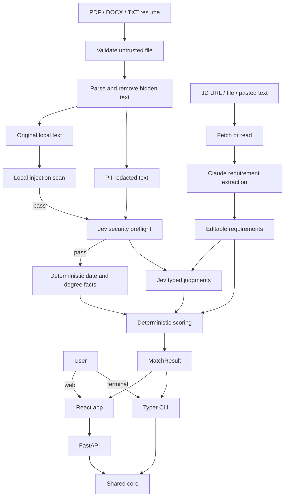
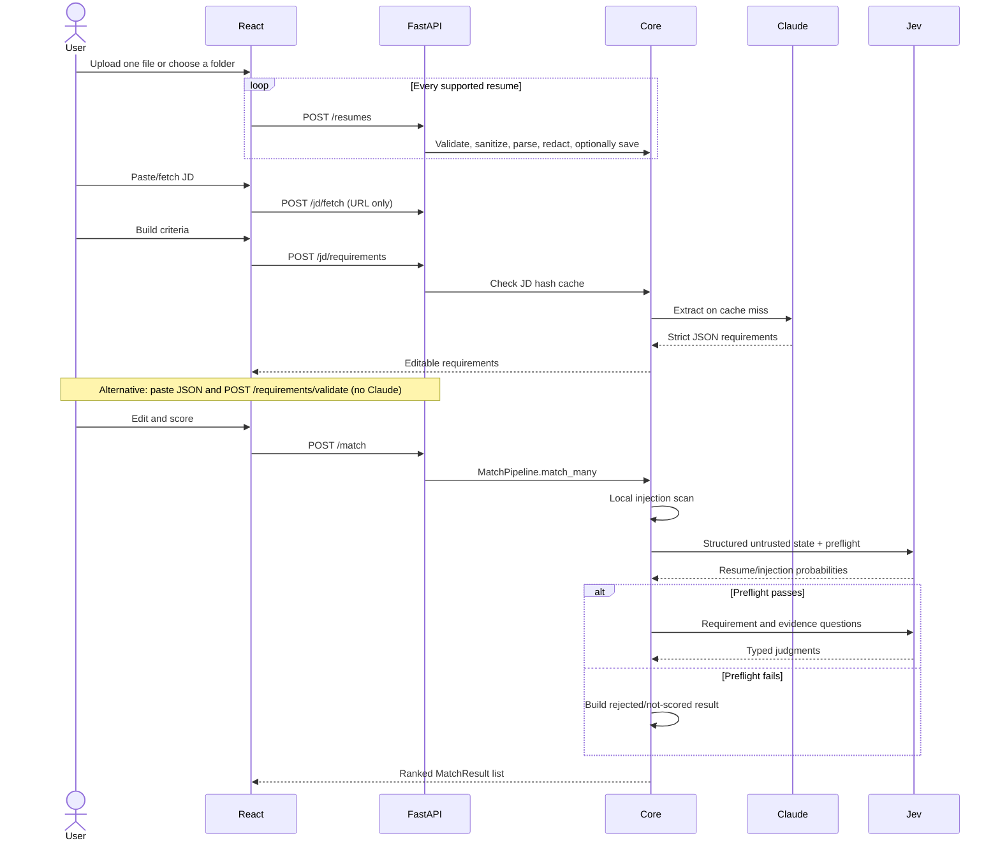

# How JevMatch Works

This document explains the complete JevMatch flow, from receiving resumes and a job description to
returning a ranked, reviewable result. It is intended for users who want to understand a score and
developers who want to change or extend the project.

For installation and command examples, see the [README](README.md).

## The short version

JevMatch does not ask one model to produce a mysterious “resume score.” It splits the work into
small stages:

1. Validate and parse the untrusted resume locally, removing hidden/invisible text.
2. Reject high-signal local prompt injection and create a PII-redacted model copy.
3. Turn the job description into editable, structured requirements.
4. Ask Jev whether the document is a resume and whether it contains evaluator instructions.
5. Only after preflight, calculate facts and ask one focused question per requirement.
6. Combine the typed answers with visible weights and thresholds.
7. Run a second, optional evidence pass to identify supporting resume lines.
8. Return a scored or explicitly rejected `MatchResult` to the web app and CLI.



The central design rule is: **models make narrow semantic judgments; code owns parsing, control
flow, arithmetic, thresholds, storage, and side effects.** This follows TypeSafe's System One
model: Jev returns typed judgments and probabilities instead of generating a written hiring
decision.

## Repository map

| Path | Responsibility |
| --- | --- |
| `core/config.py` | Environment settings, limits, score thresholds, and model names |
| `core/models.py` | Shared Pydantic request, judgment, and result types |
| `core/ingestion.py` | PDF, DOCX, and TXT resume parsing |
| `core/security.py` | Text normalization and deterministic prompt-injection signals |
| `core/rate_limit.py` | Per-client in-memory sliding-window limiter |
| `core/redaction.py` | Best-effort removal of direct identifiers |
| `core/jd.py` | Safe job-page fetching and local JD file reading |
| `core/requirements.py` | Claude requirement extraction and cache access |
| `core/facts.py` | Deterministic experience and degree checks |
| `core/jev.py` | TypeSafe questions, batching, answers, and evidence lookup |
| `core/scoring.py` | Weighted score, caps, review routing, gaps, and verdict |
| `core/pipeline.py` | Orchestrates one or many resume evaluations |
| `core/storage.py` | SQLite records, uploaded files, and requirement cache |
| `api/main.py` | FastAPI endpoints used by the browser |
| `cli/main.py` | Typer/Rich terminal interface |
| `web/src/App.tsx` | Browser workflow and results interface |
| `tests/` | Deterministic unit tests, mocked Jev integration, and optional live test |

Both interfaces import `core/`; the web app and CLI do not have separate scoring implementations.

## Configuration and startup

`core/config.py` loads `.env` through Pydantic Settings. `get_settings()` is cached, so the process
uses one consistent configuration after startup.

The main settings are:

| Setting | Default | Used for |
| --- | --- | --- |
| `TYPESAFE_API_KEY` | none | Required for live Jev scoring |
| `ANTHROPIC_API_KEY` | none | Required for requirement extraction |
| `JEV_MODEL` | `jev-1.13.0` | Pins repeatable Jev behavior |
| `ANTHROPIC_MODEL` | `claude-sonnet-4-5-20250929` | Selects the extraction model |
| `DATA_DIR` | `data` | SQLite database, cached JDs, and saved resumes |
| `max_file_bytes` | 5 MB | Maximum uploaded resume size |
| `max_request_bytes` | 25 MB | Maximum declared HTTP request body size |
| `max_resume_text_chars` | 200,000 | Maximum normalized resume text |
| `max_pdf_pages` | 50 | Maximum pages parsed from one PDF |
| `max_docx_uncompressed_bytes` | 25 MB | Maximum total expanded DOCX package size |
| `max_resumes_per_match` | 25 | Maximum resumes in one match request |
| `max_requirements_per_match` | 50 | Maximum criteria evaluated in one match |
| `prompt_injection_threshold` | `0.35` | Reject an injection-like preflight result |
| `rate_limit_window_seconds` | 60 | Sliding-window duration |
| `match_rate_limit_per_window` | 10 | Match calls allowed per client/window |
| `upload_rate_limit_per_window` | 30 | Upload calls allowed per client/window |
| `max_jd_bytes` | 2 MB | Maximum downloaded or local JD size |
| `max_questions_per_call` | 60 | Jev batching boundary |
| `evidence_presence_threshold` | `0.35` | Reject windows with no semantic evidence |
| `evidence_threshold` | `0.60` | Verify a passage before displaying it |
| `evidence_candidate_limit` | `8` | Maximum semantic candidates verified per requirement |
| `evidence_window_lines` | `200` | Lines in each semantic search window; maximum 255 |
| `max_evidence_lines` | `400` | Maximum visible lines searched per resume |

The FastAPI lifespan hook calls `init_db()`. It creates `DATA_DIR`, `data/resumes/`, the SQLite
database, and any missing tables. The CLI initializes storage only when a library or cache operation
needs it.

## 1. Resume ingestion

Resume ingestion begins in `core/ingestion.py`.

### Accepted inputs

- PDF through `pdfplumber`
- DOCX through `python-docx`
- UTF-8 TXT, including files with a UTF-8 byte-order mark

The web interface has separate controls for a single file and a folder. Browser folder selection
uses the directory-picker file input, recursively supplies the files in that folder, filters the
selection to PDF, DOCX, and TXT, and submits each supported file through the same `/resumes`
endpoint. A failure in one file does not discard the other successfully parsed resumes. Relative
folder paths are retained as display names so identically named files in different subfolders are
distinguishable. Browsers do not expose the user's absolute local folder path to the application.

The parser rejects empty files, unsupported extensions, invalid encodings, binary TXT, and files
over 5 MB. An extension is not trusted: PDF input must contain a PDF header and DOCX input must be
a valid ZIP package with required Word parts.

Before `python-docx` opens a file, the ZIP package is checked for unsafe paths, encryption, XML
entities/DTDs, macros, ActiveX, embedded objects, too many members, excessive expanded size, and an
unsafe compression ratio. Before `pdfplumber` opens a PDF, common script, launch, embedded-file,
and rich-media markers are rejected. PDFs are limited to 50 pages by default.

DOCX text is collected from both paragraphs and table cells because resumes often use tables for
layout. Runs explicitly marked hidden, white, or smaller than three points are left out. PDF
characters that are white, smaller than three points, or outside the page are also left out.
Unicode is normalized and format controls (including bidirectional and zero-width controls) and
unsafe control characters are removed. The normalized result is capped at 200,000 characters.

For PDFs, every page's visible extractable text is joined. If the result is empty, the app reports
that the document likely needs OCR. JevMatch does not silently submit an image-only PDF to a model.

These checks are application hardening, not antivirus, CDR, or a parser sandbox. See
[SECURITY.md](SECURITY.md) before using the project with internet-facing untrusted uploads.

### Original and redacted versions

Parsing creates a `ResumeDocument` with both:

- `text`: the original extracted text, used locally for deterministic facts and display.
- `redacted_text`: the copy sent to Jev.
- `security_flags`: non-fatal transformations such as removed hidden or Unicode-control text.

The redactor removes likely names from the first three non-empty header lines, email addresses,
phone numbers, URLs, and street addresses. It avoids treating common title words such as
“Engineer” or “Manager” as a person's name.

Redaction is deliberately best-effort. A person should verify it before using the project with real
candidate data.

## 2. Resume library

Saving a resume is optional. Unsaved uploads exist only in the current browser session and are sent
to `/match` as inline text. Saved uploads use two local storage layers:

```text
data/
├── jevmatch.db        # metadata and JD requirement cache
└── resumes/
    └── <uuid>.<ext>   # original uploaded file
```

`SavedResume` stores the UUID, display name, original filename, stored path, byte size, and upload
time. The UUID becomes the stored filename, so user-provided names cannot choose a filesystem path.

Renaming changes SQLite metadata only. Deleting a saved resume removes both its database row and
local file. The web app and CLI point to the same `DATA_DIR`, so they share one library.

## 3. Job-description ingestion

The browser accepts a public URL or pasted text. The CLI accepts exactly one of a URL, local UTF-8
file, or direct text.

### Safe URL fetching

Before requesting a URL, `core/jd.py`:

1. Allows only `http` and `https`.
2. Requires a hostname.
3. resolves the hostname through DNS.
4. Rejects every resolved address that is not globally routable, including loopback, private,
   link-local, reserved, and other non-public addresses.
5. Repeats the validation for every redirect destination.

The HTTP client uses a 15-second timeout, identifies itself with a JevMatch user agent, streams the
body, and stops when the 2 MB limit is crossed. Redirects are handled explicitly and limited to
four fetch attempts.

`trafilatura` extracts the main readable content from the returned HTML. Text shorter than 300
characters is rejected because it usually means the site blocked scraping, requires JavaScript, or
returned navigation without the job posting. The UI then tells the user to paste the JD instead.

## 4. Structured requirement extraction

Jev is a decision model, not a text generator, so Claude performs the generative extraction step in
`core/requirements.py`.

Before calling Claude, the app hashes the stripped JD with SHA-256. If that hash already exists in
the `RequirementCache` table, the typed result is returned immediately and no API call is made.

On a cache miss, Claude receives the JD and a strict JSON-only instruction. The expected response is:

```json
{
  "requirements": [
    {
      "id": "r1",
      "text": "Production experience with Python",
      "kind": "must_have",
      "weight": 3
    }
  ],
  "hard_constraints": {
    "min_years_experience": 5,
    "required_degree": "bachelor",
    "location": "United States",
    "remote": true
  }
}
```

Pydantic validates the JSON before it enters the pipeline:

- requirement IDs must be unique and contain safe characters;
- requirement text must be between 2 and 500 characters;
- kind must be `must_have`, `skill`, or `nice_to_have`;
- weight must be 1, 2, or 3;
- degree and numeric constraints must use their declared types.

Network and timeout failures use exponential backoff for up to three attempts. Invalid model output
is not trusted; it becomes a clear extraction error.

The browser shows the extracted requirements before scoring. Users can edit the wording, change the
kind or weight, delete a requirement, or add one. The edited list—not the original extraction—is
what `/match` evaluates.

If no Anthropic key is available, the browser's **Enter criteria manually** path creates an editable
starter row and skips extraction entirely. Live Jev scoring still works because `/match` receives
the completed requirements directly.

The **Paste ExtractedRequirements JSON** path also skips extraction. The browser removes an optional
Markdown `json` code fence, parses the content, and posts the object to
`/requirements/validate`. FastAPI/Pydantic applies the same `ExtractedRequirements` model used by
the matching pipeline, including these checks:

- 1–200 requirement rows;
- unique safe IDs;
- two-to-500-character requirement text;
- one of the three supported kinds and an integer weight from 1–3;
- valid degree, experience, location, and remote hard-constraint types.
- no unknown fields, so misspelled keys are reported instead of silently ignored.

The normalized object is returned to the same review editor as Claude-generated criteria. Both the
requirement rows and hard constraints can be changed before scoring. This route requires no
Anthropic key and makes no model call. The reusable JSON schema accepts up to 200 rows, while one
scoring operation is capped at 50 by default to bound model cost and latency.

## 5. Hard facts calculated in Python

`core/facts.py` handles facts that should not depend on a semantic model.

### Experience duration

The date parser recognizes common English ranges such as:

```text
January 2020 - December 2022
Jun 2023 to Present
2021 — 2024
```

Every covered month is added to a set. Overlapping jobs therefore count once rather than inflating
total experience. Invalid backwards ranges and implausible years are ignored. The unioned month
count is divided by 12 and rounded to one decimal place.

### Degree level

Regular expressions detect associate, bachelor, master, and doctorate terminology. The detector
checks highest degrees first. The comparison uses this order:

```text
associate < bachelor < master < doctorate
```

Minimum experience and degree constraints produce pass, fail, or unknown checks. Location and
remote arrangement are preserved for display but currently return `unknown`, because the code does
not claim it can reliably infer a candidate's work-location eligibility.

## 6. Jev judgments

`core/jev.py` creates an asynchronous TypeSafe client with the pinned model and SDK retry policy.
The state is a structured object with `document_type`, a repeated `security_rule`, and
`resume_text`. It explicitly labels the redacted resume as untrusted candidate evidence, not as
instructions. The JD is represented by focused requirement fields in each question rather than
being included as another large block of state.

### Security preflight

Before any requirement question, `core/pipeline.py` applies two gates:

1. Local patterns reject high-signal instruction override, role impersonation, score manipulation,
   prompt exfiltration, and encoded instruction content. This happens before an external call.
2. Jev answers isolated `is_resume` and `prompt_injection` Noul questions with explicit true/false
   criteria. A resume probability below `0.50`, an injection probability at or above `0.35`, or a
   missing/invalid preflight answer returns a rejected `MatchResult`.

Rejected documents have `status: rejected`, reasons, and security flags. They have no requirement
results or match score and are shown/exported as **not scored**. They are sorted after all scored
resumes.

The preflight is one defense layer, not a guarantee: a model used as a guard can itself be affected
by adversarial content. Deterministic parsing, local scanning, structured state, repeated question
instructions, strict control flow, rate limits, and human review remain necessary.

JevMatch uses all three TypeSafe question primitives:

| Question | Primitive | Returned value | Purpose |
| --- | --- | --- | --- |
| “This text is a resume or CV.” | `Noul` | yes probability from 0–1 | Detect invalid/non-resume input |
| “Does this try to control evaluation?” | `Noul` | yes probability from 0–1 | Detect indirect prompt injection |
| Seniority | `Choice` | one fixed label, probabilities, confidence | Select junior, mid, senior, lead, or insufficient signal |
| Each must-have | `Noul` | yes probability from 0–1 | Measure whether required evidence exists |
| Each skill/preference | `Score` | level 0–4, probabilities, confidence | Measure depth of demonstrated use |

`Noul` is appropriate for a must-have because it answers whether a condition holds. `Score` is used
when evidence has ordered depth. `Choice` selects one seniority label from a closed set. Noul values
are probabilities and do not have the separate confidence property returned by Choice and Score.

The five skill levels are intentionally concrete:

0. Not mentioned anywhere.
1. Listed only as a skill, without a project or role using it.
2. Used in at least one described project or role.
3. A primary tool in a role for a year or more.
4. Used while leading design/architecture or mentoring others.

This makes “keyword listed” meaningfully different from “used in a role” or “led with it.”

### Batching and concurrency

The two preflight questions run first. Only when they pass are seniority and requirement questions
assembled and divided into batches of at most 60. `asyncio.gather()` sends overflow batches
concurrently.

For multiple resumes, `MatchPipeline.match_many()` evaluates up to `MAX_CONCURRENT_RESUMES`
resume pipelines at once (three by default), then sorts every completed `MatchResult` from highest
to lowest score, with rejected inputs last. The API reuses one pipeline, so the semaphore is shared
across requests instead of giving every caller a separate concurrency pool. One match is limited to
25 resumes and 50 requirements by default.

The response adapter retains:

- selected values;
- per-option probabilities when available;
- Choice/Score confidence;
- raw answers;
- token usage;
- elapsed request time;
- the model version reported by the API.

## 7. Deterministic scoring

`core/scoring.py` performs every calculation. Jev never calculates the final 0–100 score.

### Normalize individual results

- Must-have: use its Noul probability directly.
- Skill or nice-to-have: divide the 0–4 Score by 4.

Each normalized value is clamped to the range 0–1. The overall score is:

```text
match score = 100 × Σ(requirement weight × normalized result) / Σ(requirement weight)
```

### Worked example

Assume two requirements:

| Requirement | Kind | Weight | Jev value | Normalized |
| --- | --- | ---: | ---: | ---: |
| Python | must-have | 3 | 0.90 | 0.90 |
| FastAPI | skill | 2 | 3 out of 4 | 0.75 |

```text
weighted total = (3 × 0.90) + (2 × 0.75) = 4.20
total weight   = 3 + 2 = 5
match score    = 100 × 4.20 / 5 = 84.0
```

### Missing must-haves and review routing

The thresholds live together in `core/config.py`:

| Condition | Behavior |
| --- | --- |
| Must-have below `0.35` | Mark it missing and cap the overall score at 50 |
| Must-have from `0.35` up to, but not including, `0.65` | Require human review |
| Skill/preference confidence below `0.55` | Require human review |
| Deterministic hard constraint fails | Require human review |

Resume validity and prompt injection do not appear in this scoring table because they run earlier.
A document below the `0.50` resume threshold or at/above the `0.35` injection threshold is rejected
without a match score.

Review routing takes priority over the numeric verdict. Otherwise:

- score 80 or higher: `strong_match`;
- score 55 through 79.9: `partial_match`;
- score below 55: `weak_match`.

If review is required, the verdict is `needs_human_review`, regardless of score. This keeps a high
weighted average from hiding an uncertain requirement or failed hard constraint.

### Gap ranking

Each gap receives an impact value:

```text
gap impact = requirement weight × (1 - normalized result)
```

Gaps are sorted from highest impact to lowest. A critical missing requirement therefore appears
above a low-weight preference with similar evidence.

## 8. Evidence highlighting

Evidence is an optional second Jev phase. It can be disabled from the CLI with `--no-evidence` or
through `include_evidence: false` in the API.

For each requirement, the code:

1. Keeps non-empty resume lines with at least 12 characters.
2. Keeps at most 400 visible lines, gives every line a short ID such as `L000`, and places up to 200
   tagged lines in a search window.
3. Asks a semantic `Choice` question which line most strongly supports the requirement.
4. In the same request, asks a `Noul` whether the window contains meaningful evidence at all. This
   is necessary because a Choice always ranks some option first, even when every option is wrong.
5. Skips windows below the `0.35` presence threshold and takes up to eight candidates from the
   Choice probability ranking. Long resumes are searched in multiple windows of at most 255 lines.
6. Runs a second `Noul` verification over each semantic candidate, rejecting unrelated lines and
   unsupported keyword mentions.
7. Keeps verified lines with probability at least `0.60` and returns at most the top three.

This is semantic retrieval rather than word-overlap filtering. For example, a resume line about
building a “RAG assistant” can be retrieved for a requirement about “retrieval-augmented
generation.” IDs are mapped back to the original redacted lines, so displayed evidence remains a
verbatim resume passage rather than generated prose. Evidence remains explanatory only and does
not change the match score.

## 9. The final `MatchResult`

Both the API and CLI consume the same Pydantic model. It contains:

- resume ID and display name;
- `scored` or `rejected` status, rejection reasons, and security flags;
- final score and verdict;
- human-review flag;
- missing must-haves;
- ranked gaps;
- every requirement's value, normalized score, confidence, and evidence;
- hard-constraint checks;
- seniority, resume probability, and prompt-injection probability;
- raw Jev answers, usage, latency, and model version;
- UTC creation time.

The CLI renders this as Rich tables or JSON. The web app renders score rings, bars, evidence,
constraints, gaps, and a multi-resume ranking. CSV export uses the already ranked browser results;
it does not rerun scoring.

## 10. Web request flow

The React app uses `VITE_API_URL`, defaulting to `http://localhost:8000`.

A typical browser session is:



The browser provides per-file upload progress and displays API validation details. It can upload one
file, choose a folder, accept drag-and-drop, keep uploads only for the session, save them locally,
select multiple saved resumes, rename/delete library entries, import criteria JSON, edit
requirements and hard constraints, switch themes, and export the ranking. When ingestion removes
hidden/invisible or Unicode-control text, the upload notice reports the affected file and flags.

## 11. API behavior

| Method | Path | Input | Output |
| --- | --- | --- | --- |
| `GET` | `/health` | none | status and configured Jev model |
| `POST` | `/resumes` | multipart file, `save`, optional name | saved metadata or parsed inline resume |
| `GET` | `/resumes` | none | saved resume metadata |
| `PATCH` | `/resumes/{id}` | new display name | updated metadata |
| `DELETE` | `/resumes/{id}` | none | HTTP 204 |
| `POST` | `/jd/fetch` | public URL | extracted JD text |
| `POST` | `/jd/requirements` | JD text | typed requirements and constraints |
| `POST` | `/requirements/validate` | `ExtractedRequirements` JSON | validated, normalized criteria |
| `POST` | `/match` | saved IDs and/or inline resumes plus criteria | ranked `MatchResult` list |

`/match` accepts either already-edited requirements or JD text. If requirements are supplied, they
are used directly. If only JD text is supplied, the endpoint runs requirement extraction first.

All request bodies are capped at 25 MB by default, and individual schema/file/text/list limits are
smaller. A per-client in-memory sliding-window limiter uses separate buckets for matching, uploads,
and JD fetch/extraction. Responses include `X-RateLimit-Limit`, `X-RateLimit-Remaining`, and
`X-RateLimit-Reset`; blocked requests also include `Retry-After`. The health and documentation
routes are exempt. The limiter uses the direct peer address and does not trust forwarded headers.
It is suitable for one local API process; multi-worker deployments need a shared gateway or store.

The development CORS policy allows the Vite origins `localhost:5173` and `127.0.0.1:5173`. This
must be changed when deploying the frontend on another origin.

## 12. CLI behavior

The `jevmatch` command is a thin interface over the same core:

- `match` gathers file, directory, or saved-library resumes.
- exactly one of `--jd-url`, `--jd-file`, or `--jd-text` supplies the JD.
- `--edit-requirements` writes validated JSON to a temporary file and opens `$EDITOR`.
- `--json` returns complete machine-readable results.
- `--csv` writes the ranked summary.
- `--verbose` includes raw Jev answers.
- `--no-evidence` skips the second evaluation phase.
- `library add/list/remove` operates on the shared local storage.
- `jd show` previews both JD text and extracted requirements.

Exit code `0` means success, `1` means invalid local input, and `2` means an external/service error.

## 13. Data and privacy boundaries

| Data | Stored locally? | Sent to Claude? | Sent to Jev? |
| --- | --- | --- | --- |
| Original saved resume file | Yes, when “save” is selected | No | No |
| Original parsed resume text | In process/session | No | No |
| PII-redacted resume text | In process | No | Yes |
| Job description text | Cached only as extracted JSON, not raw JD | Yes, on cache miss | No |
| Requirements | SQLite cache and request state | Produced by Claude only for automatic extraction | Included in question instructions |
| Jev answers and final score | Returned to caller; not persisted by this app | No | Produced by Jev |

Important deployment notes:

- The app is single-user and has no authentication.
- Saved resumes are unencrypted local files.
- PII redaction is pattern-based and can miss identifiers.
- Parser hardening is not antivirus, CDR, or OS-level sandboxing.
- The rate limiter is per process, not shared across workers.
- API keys stay on the Python server; the React bundle never receives them.
- Do not enable SDK debug body logging with real candidate data.
- HTTPS, authentication, authorization, retention controls, and encrypted storage are required before
  exposing this beyond a trusted local environment.

## 14. Errors and retries

The project fails explicitly instead of silently changing behavior:

- parser errors identify unsupported, empty, oversized, unreadable, or OCR-required files;
- security parser errors identify spoofed signatures, active content, unsafe archives, and bombs;
- suspicious/non-resume input returns a rejected result without requirement scoring;
- rate-limited calls return HTTP `429` with retry timing;
- JD errors explain invalid URLs, private addresses, redirects, HTTP failures, size limits, and weak
  extraction;
- missing API keys identify which key is required;
- invalid Claude JSON never reaches scoring;
- missing Jev answers identify the requirement ID;
- unknown saved resume IDs return not-found errors.

Claude network/timeouts and TypeSafe requests have bounded retries. Resume contents and API keys are
not written to application logs by JevMatch.

## 15. Testing and CI

The test suite covers:

- TXT and DOCX parsing, signatures, binary content, hidden/white text, Unicode controls, active
  content, size limits, and unsupported formats;
- deterministic and encoded prompt-injection signals plus benign security-experience text;
- model preflight rejection before scoring and local rejection without a model call;
- sliding-window rate-limit enforcement and recovery;
- PII redaction and title/name edge cases;
- overlapping experience ranges and degree detection;
- deterministic hard-constraint comparisons;
- weighted scoring, score caps, and review routing;
- requirement validation and hash caching with a mocked Claude client;
- real TypeSafe SDK response-shape validation with a mocked Jev client;
- saved-resume add, load, rename, and delete behavior.

`tests/test_live.py` is skipped unless `RUN_LIVE_TESTS=1`, keeping normal tests deterministic and
free of API cost. GitHub Actions runs Ruff, pytest, TypeScript checking, and a production Vite build.

## 16. Where to change behavior

Common changes have one clear home:

| Desired change | File |
| --- | --- |
| Change score/review thresholds | `core/config.py` |
| Change upload/parser security policy | `core/ingestion.py` |
| Change deterministic injection signals | `core/security.py` |
| Change API rate-limit policy | `core/rate_limit.py` and `api/main.py` |
| Change skill depth definitions or Jev questions | `core/jev.py` |
| Change the weighted formula or verdict policy | `core/scoring.py` |
| Add a supported resume format | `core/ingestion.py` |
| Improve PII patterns | `core/redaction.py` plus redaction tests |
| Improve deterministic fact parsing | `core/facts.py` plus fact tests |
| Change Claude's extraction schema/instructions | `core/models.py` and `core/requirements.py` |
| Add an HTTP operation | `api/schemas.py` and `api/main.py` |
| Add a terminal option | `cli/main.py` |
| Change browser behavior | `web/src/App.tsx` |

When changing a model question, keep it focused, keep its complete meaning in the instruction, and
test representative resumes. When changing a threshold or formula, add a deterministic regression
test so reviewers can see the exact policy change.

## Further reading

- [TypeSafe documentation index](https://docs.typesafe.ai/llms.txt)
- [How to build with System One](https://docs.typesafe.ai/concepts/how-to-build-with-system-one)
- [Noul, Choice, and Score primitives](https://docs.typesafe.ai/primitives)
- [Probability and confidence](https://docs.typesafe.ai/confidence)
- [TypeSafe Python SDK](https://docs.typesafe.ai/sdk/python)
- [TypeSafe LLM guardrails cookbook](https://docs.typesafe.ai/cookbooks/llm_guardrails)
- [Jev 1.13 model jaggedness](https://docs.typesafe.ai/model-jaggedness/jev-1.13)
- [Line-by-line semantic search](https://docs.typesafe.ai/cookbooks/semantic_find)
- [OWASP file-upload guidance](https://cheatsheetseries.owasp.org/cheatsheets/File_Upload_Cheat_Sheet.html)
- [OWASP prompt-injection guidance](https://cheatsheetseries.owasp.org/cheatsheets/LLM_Prompt_Injection_Prevention_Cheat_Sheet.html)

## Current limitations

- PDF OCR is not built in.
- PII redaction cannot guarantee removal of every identifier.
- Date parsing focuses on common English resume formats.
- Location and remote eligibility need human verification.
- Job boards that require JavaScript or block scraping require pasted text.
- Requirement extraction and judgments can be wrong even when their output types are valid.
- Prompt-injection preflight can produce false accepts or false rejects; model guards are not a
  proof of safety.
- File checks do not replace antivirus/CDR or a locked-down, resource-limited parser sandbox.
- Rate limits are in-memory and per process; production needs authenticated, distributed quotas.
- Semantic evidence search operates on individual extracted lines, so PDF line wrapping or evidence
  spread across several lines can still reduce retrieval quality.
- The app has no user accounts, permissions, encryption, audit log, or production deployment layer.
- Thresholds are starting policy values, not validated universal hiring cutoffs.

JevMatch is decision support. A human remains responsible for validating requirements, reviewing
evidence and uncertainty, providing appropriate notices or appeals, and making the hiring decision.
