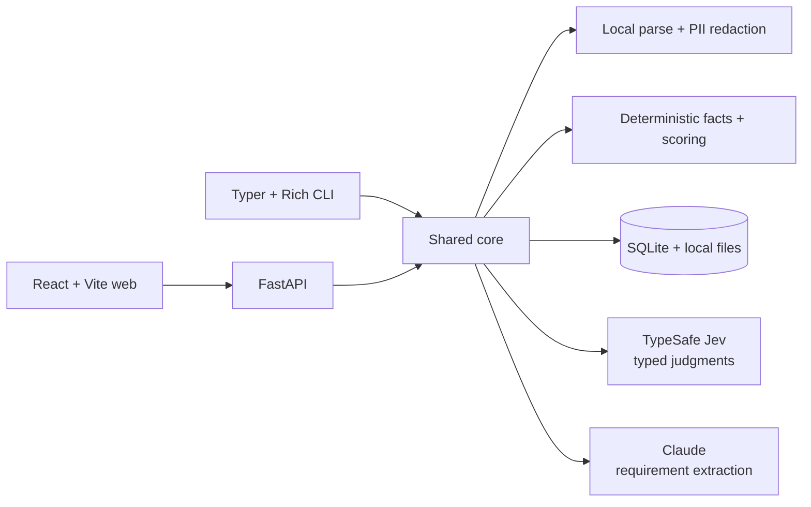

# JevMatch

[](https://github.com/Dipeshtripathi13/jevmatch/actions/workflows/ci.yml)
[](LICENSE)
[](https://www.python.org/)

JevMatch is an open-source, human-in-the-loop resume and job-description match scorer powered by
[TypeSafe Jev](https://docs.typesafe.ai/). It ships as a responsive web app and a Rich terminal app
that share one typed Python core. It shows the inputs behind each score, surfaces uncertainty, and
keeps final hiring decisions with people.

> **Alpha software:** use synthetic data while evaluating the project. Do not use it as the sole
> basis for employment decisions.

## What it does

- Parses PDF, DOCX, and TXT resumes with a 5 MB limit and a clear OCR error for scanned PDFs.
- Redacts names, emails, phone numbers, URLs, and street addresses before external model calls.
- Fetches job descriptions with DNS-aware SSRF protection, or accepts pasted text/local files.
- Uses Claude once per JD to extract editable requirements and hard constraints, cached by hash.
- Uses narrow Jev `Noul`, `Score`, and `Choice` questions to judge resume evidence.
- Computes date ranges, degree checks, weighted scores, caps, gaps, and verdicts in plain code.
- Ranks multiple resumes, explains uncertainty, highlights evidence, and exports CSV.
- Stores saved resumes in local SQLite and `data/resumes/`; no authentication is included yet.

## Architecture



The JD never needs to be placed in Jev's state. Jev receives only the redacted resume and atomic,
self-contained requirement questions. Raw candidate text stays local except for the explicitly
documented model calls; application logs do not contain resume contents or API keys.

## Quick start

Requirements: Python 3.11+, [uv](https://docs.astral.sh/uv/getting-started/installation/), Node.js
20+, and TypeSafe and Anthropic API keys.

```bash
git clone https://github.com/Dipeshtripathi13/jevmatch.git
cd jevmatch
cp .env.example .env
# Add TYPESAFE_API_KEY and ANTHROPIC_API_KEY to .env
make install
make dev
```

Open `http://localhost:5173`. The FastAPI docs are at `http://localhost:8000/docs`.

### Environment variables

| Variable | Required | Purpose |
| --- | --- | --- |
| `TYPESAFE_API_KEY` | For scoring | TypeSafe API credential |
| `ANTHROPIC_API_KEY` | For JD extraction | Anthropic API credential |
| `JEV_MODEL` | No | Pinned model; defaults to `jev-1.13.0` |
| `DATA_DIR` | No | SQLite, resume files, and cache; defaults to `./data` |
| `ANTHROPIC_MODEL` | No | Requirement-extraction model |

Never commit `.env`. Jev SDK debug logging can include request bodies, so this application does not
enable it.

## CLI

```bash
# One resume and a pasted/local/remote job description
uv run jevmatch match --resume ./cv.pdf --jd-file ./job.txt
uv run jevmatch match --resume ./cv.pdf --jd-url https://example.com/job --json

# Compare a directory and export the ranking
uv run jevmatch match --resume-dir ./resumes --jd-file ./job.txt --csv ranking.csv

# Local library shared with the web app
uv run jevmatch library add ./cv.pdf --name "Backend profile"
uv run jevmatch library list
uv run jevmatch match --saved <id> --jd-file ./job.txt

# Inspect extraction before scoring
uv run jevmatch jd show --file samples/job_descriptions/backend_engineer.txt
```

Use `--edit-requirements` to open extracted criteria in `$EDITOR`, `--verbose` to inspect raw Jev
answers, `--no-evidence` for a faster phase-one run, or `--model` to explicitly select a model.
Exit code `1` means invalid local input and `2` means an external API failure.

## Scoring behavior

Must-haves use Jev's yes probability. Skills and preferences use five concrete levels from “not
mentioned” (0) through “led architecture or mentored others” (4), normalized to 0–1. The final
score is a deterministic weighted average:

```text
match score = 100 × Σ(weight × normalized evidence) / Σ(weight)
```

A must-have below `0.35` caps the score at 50. Borderline must-haves, low-confidence skill scores,
non-resume-like input, and failed hard constraints route the result to human review. All thresholds
live in [`core/config.py`](core/config.py). Evidence highlighting runs as a second Jev phase and
returns up to three resume lines per requirement above the configured threshold.

## Development

```bash
make test       # Python tests and production frontend build
make lint       # Ruff and TypeScript checks
make format
```

Tests use mocked response fixtures shaped like the TypeSafe API and do not need API keys. An opt-in
smoke test is available with `RUN_LIVE_TESTS=1 uv run pytest -m live`. The `samples/` directory has
two synthetic JDs and three deliberately different synthetic resumes, including a keyword stuffer.

## API surface

| Method | Endpoint | Purpose |
| --- | --- | --- |
| `POST` | `/resumes` | Validate/upload a resume, optionally save it |
| `GET` | `/resumes` | List saved resumes |
| `PATCH/DELETE` | `/resumes/{id}` | Rename or delete a saved resume |
| `POST` | `/jd/fetch` | Safely fetch and extract a public job URL |
| `POST` | `/jd/requirements` | Extract/cache editable requirements |
| `POST` | `/match` | Score saved IDs and/or inline parsed resumes |
| `GET` | `/health` | Health and configured model |

This is currently a single-user, local-first app with no authentication. Storage functions and API
schemas are separated so a future `user_id` and authorization layer can be added without changing
the scoring domain.

## Limitations and responsible use

JevMatch ranks and flags; it does not make hiring decisions. Model judgments can be wrong,
incomplete, or affected by unusual formatting and adversarial resume content. PII redaction is
best-effort, not a guarantee. Date extraction supports common English resume ranges and may miss
unusual formats. Job boards may block scraping or render content with JavaScript; paste the JD when
that happens. Degree and experience checks should always be verified by a person.

Employment tools can reproduce historical bias or create unlawful disparate impact. Validate the
criteria, provide an accommodation and appeal path, monitor outcomes, minimize retained data, and
obtain appropriate legal review. Laws such as New York City Local Law 144 may require an independent
bias audit and candidate notice before an automated employment decision tool is used. Other
jurisdictions impose additional requirements. This project is not legal advice.

## Contributing and security

Contributions are welcome; see [CONTRIBUTING.md](CONTRIBUTING.md). Report vulnerabilities privately
as described in [SECURITY.md](SECURITY.md), especially anything involving SSRF, stored resumes, or
PII leakage. Community participation follows the [Code of Conduct](CODE_OF_CONDUCT.md).

Released under the [MIT License](LICENSE).
