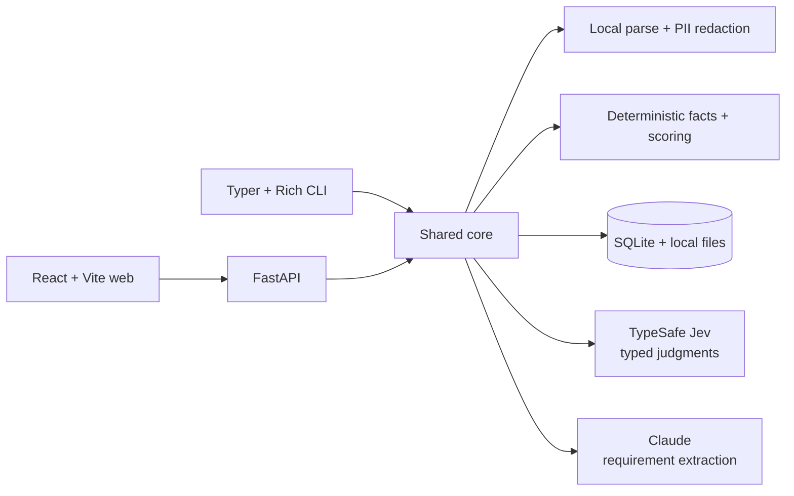

# JevMatch

[](https://github.com/Dipeshtripathi13/jevmatch/actions/workflows/ci.yml)
[](LICENSE)
[](https://www.python.org/)

JevMatch is an open-source, human-in-the-loop resume and job-description match scorer powered by
[TypeSafe Jev](https://docs.typesafe.ai/). It ships as a responsive web app and a Rich terminal app
that share one typed Python core. It shows the inputs behind each score, surfaces uncertainty, and
keeps final hiring decisions with people.

> **Alpha software:** use synthetic data while evaluating the project. Do not use it as the sole
> basis for employment decisions.

## What it does

- Uploads one resume or a whole folder, validates PDF/DOCX signatures, rejects active content and
  unsafe archives, removes hidden/invisible text, and reports a clear OCR error for scanned PDFs.
- Redacts names, emails, phone numbers, URLs, and street addresses before external model calls.
- Fetches job descriptions with DNS-aware SSRF protection, or accepts pasted text/local files.
- Uses Claude once per JD to extract editable requirements and hard constraints, cached by hash, or
  validates pasted `ExtractedRequirements` JSON without calling Anthropic.
- Uses narrow Jev `Noul`, `Score`, and `Choice` questions to judge requirements and semantically
  retrieve supporting resume evidence without word-overlap filtering.
- Rejects obvious prompt injection locally, then runs isolated Jev resume-validity and injection
  preflight checks before any scoring request.
- Computes date ranges, degree checks, weighted scores, caps, gaps, and verdicts in plain code.
- Ranks multiple resumes, explains uncertainty, highlights evidence, and exports CSV.
- Bounds request, batch, page, archive, and text sizes and rate-limits costly API operations.
- Stores saved resumes in local SQLite and `data/resumes/`; no authentication is included yet.

## Architecture



The JD never needs to be placed in Jev's state. Jev receives a structured state that labels the
redacted resume as untrusted data, plus atomic, self-contained questions that repeat the security
boundary. Raw candidate text stays local except for the explicitly documented model calls;
application logs do not contain resume contents or API keys.

For a complete stage-by-stage walkthrough—including data flow, model questions, score math,
privacy boundaries, storage, API/CLI behavior, and extension points—see
[HOW_IT_WORKS.md](HOW_IT_WORKS.md).

## Quick start

Requirements: Python 3.11+, [uv](https://docs.astral.sh/uv/getting-started/installation/), Node.js
22+ and a TypeSafe API key. An Anthropic key is optional; without one, enter job criteria manually
or paste a previously prepared `ExtractedRequirements` JSON object in the web app.

```bash
git clone https://github.com/Dipeshtripathi13/jevmatch.git
cd jevmatch
cp .env.example .env
# Add TYPESAFE_API_KEY and ANTHROPIC_API_KEY to .env
make install
make dev
```

Open `http://localhost:5173`. The FastAPI docs are at `http://localhost:8000/docs`.

### Environment variables

| Variable | Required | Purpose |
| --- | --- | --- |
| `TYPESAFE_API_KEY` | For scoring | TypeSafe API credential |
| `ANTHROPIC_API_KEY` | For automatic JD extraction | Optional Anthropic API credential |
| `JEV_MODEL` | No | Pinned model; defaults to `jev-1.13.0` |
| `DATA_DIR` | No | SQLite, resume files, and cache; defaults to `./data` |
| `ANTHROPIC_MODEL` | No | Requirement-extraction model |
| `MAX_CONCURRENT_RESUMES` | No | Simultaneous resume pipelines; defaults to `3` |
| `MAX_RESUMES_PER_MATCH` | No | Resumes accepted in one match request; defaults to `25` |
| `MAX_REQUIREMENTS_PER_MATCH` | No | Criteria evaluated per match; defaults to `50` |
| `PROMPT_INJECTION_THRESHOLD` | No | Reject at or above this preflight probability; defaults to `0.35` |
| `RATE_LIMIT_ENABLED` | No | Enables per-client API rate limits; defaults to `true` |
| `MATCH_RATE_LIMIT_PER_WINDOW` | No | Match calls per 60-second window; defaults to `10` |
| `EVIDENCE_PRESENCE_THRESHOLD` | No | Skip semantic windows below this evidence probability |
| `EVIDENCE_THRESHOLD` | No | Minimum verification probability for displayed evidence |

Never commit `.env`. Jev SDK debug logging can include request bodies, so this application does not
enable it.

### Web workflow without Anthropic

1. Under **Choose resumes**, use **Upload one resume** or **Choose a resume folder**. Folder upload
   keeps every valid PDF, DOCX, and TXT file and reports unsupported or unreadable files separately.
2. Under **Add the job**, open **Paste ExtractedRequirements JSON**, paste the complete object, and
   select **Validate and load JSON**. JSON copied with a Markdown `json` code fence also works.
3. Review the requirements and hard constraints, then select **Score with Jev**. Results are sorted
   from highest to lowest match score and can be exported as CSV.

The JSON must contain 1–200 requirements with unique IDs, valid kinds (`must_have`, `skill`, or
`nice_to_have`), weights from 1–3, and correctly typed optional hard constraints. Validation uses
the local FastAPI server, rejects unknown fields, and does not call Anthropic.
Scoring is separately capped at 50 requirements per request by default.

## CLI

```bash
# One resume and a pasted/local/remote job description
uv run jevmatch match --resume ./cv.pdf --jd-file ./job.txt
uv run jevmatch match --resume ./cv.pdf --jd-url https://example.com/job --json

# Compare a directory and export the ranking
uv run jevmatch match --resume-dir ./resumes --jd-file ./job.txt --csv ranking.csv

# Local library shared with the web app
uv run jevmatch library add ./cv.pdf --name "Backend profile"
uv run jevmatch library list
uv run jevmatch match --saved <id> --jd-file ./job.txt

# Inspect extraction before scoring
uv run jevmatch jd show --file samples/job_descriptions/backend_engineer.txt
```

Use `--edit-requirements` to open extracted criteria in `$EDITOR`, `--verbose` to inspect raw Jev
answers, `--no-evidence` for a faster phase-one run, or `--model` to explicitly select a model.
Exit code `1` means invalid local input and `2` means an external API failure.

## Scoring behavior

Must-haves use Jev's yes probability. Skills and preferences use five concrete levels from “not
mentioned” (0) through “led architecture or mentored others” (4), normalized to 0–1. The final
score is a deterministic weighted average:

```text
match score = 100 × Σ(weight × normalized evidence) / Σ(weight)
```

A must-have below `0.35` caps the score at 50. Borderline must-haves, low-confidence skill scores,
and failed hard constraints route the result to human review. Non-resume-like or injection-like
input is rejected before scoring and shown as **not scored**, never as a zero-quality candidate.
All thresholds live in [`core/config.py`](core/config.py). Evidence highlighting runs only after
preflight and uses semantic `Choice` retrieval plus `Noul` verification.

## Development

```bash
make test       # Python tests and production frontend build
make lint       # Ruff and TypeScript checks
make format
```

Tests use mocked response fixtures shaped like the TypeSafe API and do not need API keys. An opt-in
smoke test is available with `RUN_LIVE_TESTS=1 uv run pytest -m live`. The `samples/` directory has
two synthetic JDs and three deliberately different synthetic resumes, including a keyword stuffer.

## API surface

| Method | Endpoint | Purpose |
| --- | --- | --- |
| `POST` | `/resumes` | Validate/upload a resume, optionally save it |
| `GET` | `/resumes` | List saved resumes |
| `PATCH/DELETE` | `/resumes/{id}` | Rename or delete a saved resume |
| `POST` | `/jd/fetch` | Safely fetch and extract a public job URL |
| `POST` | `/jd/requirements` | Extract/cache editable requirements |
| `POST` | `/requirements/validate` | Validate pasted criteria without model extraction |
| `POST` | `/match` | Score saved IDs and/or inline parsed resumes |
| `GET` | `/health` | Health and configured model |

This is currently a single-user, local-first app with no authentication. Storage functions and API
schemas are separated so a future `user_id` and authorization layer can be added without changing
the scoring domain.

## Security model

Resume files are untrusted. The parser checks extension and file signature, rejects PDF active
content and DOCX macros/embedded objects, limits PDF pages and DOCX expansion/compression, removes
explicitly hidden, white, tiny, off-page, and Unicode-control text, and caps extracted text. It does
not execute document content.

After parsing, high-signal evaluator instructions are rejected by local code. Remaining documents
go through separate Jev `is_resume` and `prompt_injection` preflight questions. Requirement scoring
and evidence extraction do not run unless both checks pass. Every Jev state labels resume text as
untrusted and each question instructs the model to treat it only as candidate evidence.

FastAPI applies body and collection bounds plus an in-memory sliding-window limiter. One match is
limited to 25 resumes and 50 criteria, and evidence search considers at most 400 visible lines per
resume. The default limits are 10 match calls, 10 extraction/fetch calls, and 30 uploads per client
per 60 seconds; other routes default to 120. A rejected request returns HTTP `429` and
`Retry-After`. Resume concurrency is shared across requests, rather than reset for each caller.

These controls reduce risk; they do not prove a file safe or make prompt injection impossible. This
project does not include antivirus/CDR, a parser subprocess sandbox, authentication, or a shared
distributed limiter. Before an internet-facing deployment, add those controls at the upload
service/API gateway and store resumes in isolated, encrypted object storage. See
[SECURITY.md](SECURITY.md) for the threat model and deployment requirements.

## Limitations and responsible use

JevMatch ranks and flags; it does not make hiring decisions. Model judgments and security
classifiers can be wrong, including false accepts and false rejects. PII redaction is best-effort,
not a guarantee. Date extraction supports common English resume ranges and may miss unusual
formats. Job boards may block scraping or render content with JavaScript; paste the JD when that
happens. Degree, experience, and security flags should always be reviewable by a person.

Employment tools can reproduce historical bias or create unlawful disparate impact. Validate the
criteria, provide an accommodation and appeal path, monitor outcomes, minimize retained data, and
obtain appropriate legal review. Laws such as New York City Local Law 144 may require an independent
bias audit and candidate notice before an automated employment decision tool is used. Other
jurisdictions impose additional requirements. This project is not legal advice.

## Contributing and security

Contributions are welcome; see [CONTRIBUTING.md](CONTRIBUTING.md). Report vulnerabilities privately
as described in [SECURITY.md](SECURITY.md), especially anything involving SSRF, stored resumes, or
PII leakage. Community participation follows the [Code of Conduct](CODE_OF_CONDUCT.md).

Released under the [MIT License](LICENSE).
